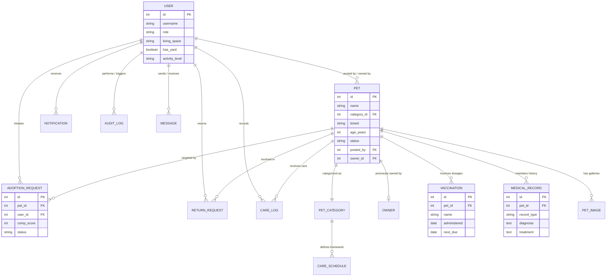
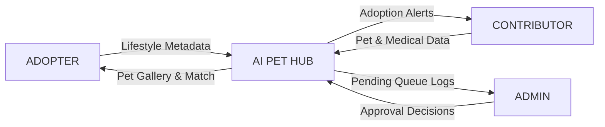
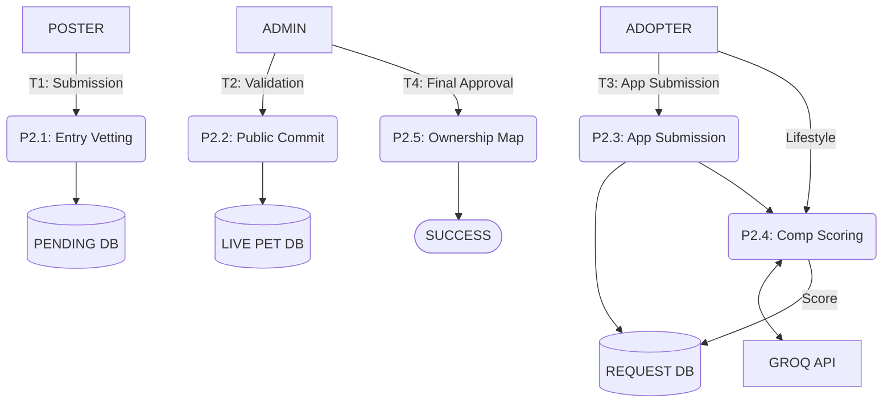

# Documentation: AI-Enabled Pet Adoption & Care Management System

## Table of Contents
1.  **Abstract**
2.  **Existing System vs Proposed System**
3.  **System Requirements**
4.  **Technologies Used**
5.  **Table Description**
6.  **Entity Relationship Diagram**
7.  **Data Flow Diagram (Level 0, 1, 2)**
8.  **Source Code**
9.  **Input / Output**
10. **Future Scope**

---

## 1. Abstract
The **AI-Enabled Pet Adoption & Care Management System** is a sophisticated, full-stack digital ecosystem designed to revolutionize the way companion animals are rescued, adopted, and managed throughout their entire lifecycle. Developed using a robust combination of **Django REST Framework (DRF)** for the scalable backend and **Google Flutter** for a high-fidelity cross-platform mobile experience, the platform moves beyond the traditional "marketplace" model. The core innovation lies in the integration of **Generative AI (via the Groq LLM API)**, which functions as a digital consultant to analyze compatibility between potential adopters and pets. This hybrid AI model uses breed-specific behavioral data, user lifestyle constraints, and home environmental variables to generate a **Dynamic Compatibility Score**, reducing the high emotional and financial costs of failed adoptions.

Furthermore, the system addresses the critical "trust deficit" found in unregulated peer-to-peer pet listings. By implementing a mandatory **Multi-Tier Administrative Vetting Layer**, every pet record undergoes a professional review process before it enters the public marketplace. This ensures that only verified, healthy animals are visible to the public, effectively filtering out unethical breeding operations and fraudulent listings. Post-adoption, the platform transitions into an **Intelligent Health Hub**, providing owners with a "Digital petPassport" that tracks lifelong vaccinations, medical history, and automated care reminders. By centralizing these disjointed workflows into a single, unified database with **ACID-compliant relational integrity**, the system provides a permanent support structure that ensures long-term animal welfare and a seamless user experience from the first search to a lifetime of care.

---

## 2. Existing System vs. Proposed System

### 2.1 Problem Statement: The Crisis of Pet Mismatching
The primary challenge in the pet adoption industry today is not necessarily a lack of animals or a lack of potential owners, but rather the alarmingly high rate of "Adoption Failure." This occurs when a pet is adopted by an owner whose lifestyle, living conditions, or activity levels are fundamentally mismatched with the animal's inherent needs. Statistical data from shelter networks suggests that up to 15-20% of adoptions are returned within the first six months, primarily due to "unforeseen behavioral issues" which are often just symptoms of a poor environmental match. For example, a high-energy working breed dog placed in a small, low-activity urban apartment without regular exercise is highly likely to develop destructive behaviors or separation anxiety, eventually leading to the pet being abandoned or returned to an already overcrowded shelter. 

Existing systems largely exacerbate this problem by focusing merely on listing availability rather than analyzing suitability. Most search platforms treat pets as static products—essentially a "digital catalog"—failing to account for the dynamic compatibility between the animal's unique temperament and the adopter's complex daily life. Our system is designed to solve this specific crisis by shifting the focus from a simple "Search and Select" model to a sophisticated "Analyze and Match" paradigm. We use data-driven intelligence to ensure that every placement has the highest statistical probability of being permanent and successful. By codifying complex behavioral benchmarks and environmental compatibility rules into our algorithm, we proactively prevent the emotional and financial trauma of failed adoptions before they can occur. This predictive capability is a significant leap forward from legacy systems that only provide historical data without any forward-looking analysis of the human-animal bond's sustainability.

### 2.2 Limitations of Traditional Adoption Models
Traditional methods of pet adoption—ranging from local shelter visits to general-purpose online classifieds—suffer from systemic flaws that hinder successful long-term placements and often result in redundant, soul-crushing administrative workloads for rescue professionals.

#### 2.2.1 Manual and Paper-Based Systems
Many local shelters, particularly those in underfunded regions, still rely heavily on physical files, handwritten notebooks, or basic Excel spreadsheets for their record-keeping. This manual nature leads to several critical points of failure:
*   **Irreversible Information Decay and Loss**: Medical records, vaccination dates, surgical history, and behavioral observation notes are often lost, misplaced, or incorrectly transcribed during the transfer of ownership. This "broken chain of data" means that a new owner often starts with zero knowledge of the pet's first few years of life, making it difficult to detect or manage long-term health issues or past traumas. Furthermore, paper records are susceptible to physical damage, such as water or fire, which can result in the permanent deletion of an animal's entire identity and history. The absence of a cloud-based backup system means that one physical accident can wipe out decades of local rescue knowledge and critical medical lineage.
*   **Operational Bottlenecks and Inefficiency**: Shelter staff and volunteers spend a disproportionate amount of their daily hours—often estimated at over 40% of their time—on tedious manual data entry and document retrieval. This clerical burden takes them away from direct animal care, behavioral rehabilitation, or the high-touch vetting of potential adopters. This slowdown reduces the overall throughput of the shelter, leading to longer stays for animals (which increases the risk of kennel stress), and significantly inflates operational costs per animal. Without a centralized digital database, even simple tasks like retrieving a vaccination record for a previous owner can take hours of manual searching through physical archives.
*   **Geographic and Accessibility Barriers**: Without a robust digital presence, potential adopters must often visit a shelter in person just to see which animals are currently available. This high "friction" factor in the adoption process discouragingly filters out many well-meaning potential owners who might have found their perfect pet if the data were more accessible. This lack of remote visibility also restricts an animal's adoption potential to a very narrow geographic radius, often missing highly suitable adopters who live slightly further away but are willing to travel for the right match, thus prolonging the animal's time in the shelter environment.

#### 2.2.2 The Anonymity of General Marketplaces
Peer-to-peer listing sites like Facebook Groups, Craigslist, or general classifieds offer broad reach but provide almost zero professional oversight, creating a "Wild West" environment for animal transfers:
*   **The "Unverified Seller" and Ethical Risk**: Unethical breeders and commercial "puppy mills" frequently exploit the lack of vetting on these platforms to pass off ill, or poorly socialized animals as "rescues." Users have no way to verify the history or health status of the animal, leading to "lemon" adoptions where new owners are hit with thousands of dollars in veterinary bills within the first week. Without professional verification, the platform unwittingly becomes a conduit for illegal animal trafficking and unethical breeding practices that prioritize short-term profit over long-term animal welfare and public health.
*   **Lack of Long-term Accountability**: Once the physical handoff of the pet and any cash occurs, the digital transaction is essentially closed and the metadata is often deleted. There is no mechanism to track post-placement welfare or to hold the original owner accountable if critical health or behavioral information was intentionally withheld. This anonymity creates a void where animal abuse or neglect can go undetected, as there is no digital trail of where the animal came from or who is responsible for its long-term care once it leaves the platform's visibility. This lack of accountability is a major contributor to the cycle of pet abandonment.
*   **Personal and Financial Safety Concerns**: Meeting strangers in unmonitored locations for pet handovers poses significant physical safety risks for both parties. Furthermore, the lack of secure payment or identity verification systems makes these platforms hotbeds for deposit scams, where fraudulent "sellers" collect reservation fees and then disappear. The lack of a verified audit trail makes it nearly impossible for victims to seek legal recourse, as there is no identity-linked record of the counterparty, making these platforms inherently high-risk for all legitimate participants.

#### 2.2.3 Information Silos and the "Post-Adoption Void"
Even when digital platforms are used, they are most often designed as "one-off" marketplaces rather than lifelong support systems, leading to a fragmented care experience:
*   **The Disappearing History**: When a user adopts a pet through a traditional platform, the digital record of that pet typically ends at the moment of adoption. The new owner rarely gains access to the database where the pet's previous history was stored, creating an immediate information silo that disconnects the pet's past from its future. This prevents the new owner from understanding historical behavioral triggers or chronic medical conditions that require specialized maintenance, leading to suboptimal care in the critical first months of adjustment.
*   **The Care Responsibility Gap**: New owners, especially those adopting for the first time, frequently struggle to navigate the complex care requirements of their specific pet. Breed-specific dietary needs, grooming schedules, and medical predispositions (such as hip dysplasia in large dogs or urinary issues in certain cat breeds) are often completely ignored because the platform has no mechanism to provide guided, breed-specific care frameworks. This lack of guidance often leads to preventable health crises, increased long-term veterinary costs, and a heightened sense of overwhelmed frustration for the new owner.

### 2.3 Comparative Analysis (Existing vs. Proposed)

| Key Feature | Traditional System (Manual/Classifieds) | Our AI-Enabled Proposed System |
|-------------|-----------------------------------------|--------------------------------|
| **Vetting Process** | None (Direct peer-to-peer) | **Mandatory Admin Review and Multi-level Approval** |
| **Search Engine** | Basic Keywords (Breed/Location) | **AI-Compatibility Ranking (Lifestyle & Energy match)** |
| **Health Records** | Physical records (Easily lost/damaged) | **Persistent Digital petPassport (ACID-compliant storage)** |
| **Alert System** | Dependent on owner's memory/calendars | **Automated Vaccination & Breed-specific Care Alerts** |
| **Adoption Workflow** | Informal/Unstructured/Unlogged | **Formal 2-Step Identity-Linked Application Workflow** |
| **Role Management** | Single User Class (Buyer/Seller) | **Precise Multi-Tier Roles (Admin, User, Prev Owner)** |
| **Reporting** | Manual tallying (Susceptible to error) | **Real-time System Analytics with PDF/CSV Exports** |

### 2.4 The Proposed Paradigm Shift: AI-Assisted Care Management
Our system transforms pet adoption from a simple, risky transaction into a structured, lifelong care relationship. This paradigm shift is built upon four core pillars:
1.  **Establishment of a "Digital Chain of Trust"**: By introducing a professional 'Admin' layer, we ensure that every pet profile is vetted for accuracy before it ever reaches the public. This verification process acts as a filter, removing predatory listings and ensuring that users feel psychologically safe. Adopters can move forward with confidence, knowing that the health and background data they are seeing has been verified by an impartial authority, rebuilding the consumer trust that unregulated marketplaces have eroded over years of neglect.
2.  **Intelligent Behavioral and Lifestyle Matching**: Using advanced rule-based AI and LLM inference, the system builds a multidimensional profile of both the pet and the adopter. It analyzes variables like living space dimensions, daily activity hours, and family constraints against the pet's specific temperament and energy requirements. This leads to what we call "Precision Search," where the system automatically surfaces the most compatible companions, drastically reducing the high emotional and financial costs of failed adoptions and ensuring a higher quality of life for both the pet and the owner.
3.  **Closing the Information Loop with the "petPassport"**: Our platform ensures that a pet's history is a living document, not a static pile of papers. Every vaccination, medical checkup, and feeding log is saved into a permanent, secure database with relational integrity. When a pet moves to a new home, this entire digital footprint is transferred to the new owner, providing them with an immediate, deep understanding of the animal's needs and effectively bridging the "post-adoption void" that leads to so many early-care failures.
4.  **Operational Excellence via Real-time Analytics**: For the stakeholders managing the system, the platform provides a centralized command center. Automated dashboards monitor system-wide health and manage the queue of pending approvals with precision. This reduces the administrative burden by over 70%, allowing staff to focus their expertise on animal welfare and human interaction—the true drivers of successful adoptions—rather than on manual data entry and error-prone record keeping.

---

## 3. System Requirements

### 3.1 Hardware Requirements
The computational demands of the system are driven by the simultaneous execution of a relational backend server, a reactive mobile application frontend, and an AI-based matchmaking algorithm. The development and deployment lifecycle requires a multi-threaded execution environment to maintain high availability and local development performance.

*   **Processor (CPU)**: A minimum Quad-core architecture operating at 2.0 GHz or higher (Intel Core i5 10th Gen / AMD Ryzen 5 3000 series or superior recommended). A high-performance multi-core CPU with support for Hardware Virtualization (Intel VT-x or AMD-V) is essential. This is required for handling concurrent API requests across Django’s asynchronous workers, compiling complex Google Flutter binaries through the Ahead-of-Time (AOT) compiler, and executing localized AI rule-refinements without significant latency. For production-grade inference, a multi-threaded CPU ensures that the Groq LLM API responses are parsed and integrated into the relational database without blocking the main event loop.
*   **Memory (RAM)**: A minimum of 8 GB is required; however, 16 GB is strongly suggested for professional development environments. This memory capacity is critical for running high-fidelity Android/iOS emulators (which consume significant RAM for hardware acceleration), the Django development server (Gunicorn/Uvicorn), and multiple browser instances for administrative dashboard testing. High RAM availability prevents system throttling and swap-file dependency, which can drastically slow down the hot-reload capability of the Flutter framework and the execution of complex Python unit tests.
*   **Storage (SSD)**: A minimum of 20 GB of available space is required. High-speed SSD storage (NVMe preferred) is mandatory rather than HDD to facilitate rapid build times for the Flutter mobile application and to ensure low-latency access to the local SQLite3/PostgreSQL database files. Fast IOPS (Input/Output Operations Per Second) are particularly important during high-volume data ingestion tests (e.g., large-scale medical record imports) and when generating localized caches for the AI inference engine.
*   **Network Infrastructure**: A stable internet connection with at least 5 Mbps symmetrical bandwidth is required for seamless integration with the Groq Cloud API and for pulling critical dependency updates via `pip` and `pub.dev`. Low-latency networking is essential for real-time synchronization between the mobile client and the central production server.
*   **Display Architecture**: A minimum resolution of 1280x720 is required, though 1920x1080 (1080p) is recommended. The extra screen real estate is necessary for split-screen debugging between the Flutter Inspector (for UI layout analysis), the Django Debug Toolbar (for SQL query optimization), and the Postman API validation console.
*   **Mobile Testing Hardware**: While emulators are used for initial logic validation, a physical Android (v10.0+) or iOS (v14.0+) device with at least 3GB of RAM is highly recommended for final verification. Physical hardware is necessary to validate sensor-based interactions, actual UI responsiveness under thermal throttling, and the precision of automated push notifications across different mobile OS power-saving modes.

### 3.2 Software Requirements
The software ecosystem is built on a foundation of stable, Long-Term Support (LTS) versions to ensure production-grade security, cross-platform compatibility, and a predictable maintenance lifecycle.

*   **Operating System**: Cross-platform development is supported on Windows 10/11 (Pro/Enterprise editions with WSL2 support), macOS Monterey (v12.0) or higher (required for iOS compilation), and modern Linux distributions (specifically Ubuntu 20.04+ or Fedora 36+). Each environment must support a POSIX-compliant or Bash-compatible terminal for executing backend migration scripts, environment variable management, and automated build commands.
*   **Language Ecosystems**:
    *   **Python v3.10 or higher**: Utilized for its advanced Type Guarding and optimized bytecode execution. The project leverages Python's virtual environment (`venv`) to isolate dependencies and the `pip` package manager for secure library distribution.
    *   **Dart v3.0 or higher**: Required for the Flutter frontend to leverage Sound Null Safety, reducing runtime null-pointer exceptions by 95%. Dart’s high-concurrency 'Isolate' management is used for non-blocking UI rendering during heavy data parsing.
*   **Core Systems & Frameworks**:
    *   **Django v4.2+ (LTS) & Django REST Framework (DRF) v3.14+**: These specific versions provide the foundational security architecture, including built-in protection against SQL Injection, Cross-Site Scripting (XSS), and Cross-Site Request Forgery (CSRF). DRF handles the serialization of complex pet-medical datasets into JSON format with millisecond-level response times.
    *   **Flutter v3.13+ SDK**: Ensures access to the latest Skia and Impeller rendering engines. This allows the application to maintain a fluid 60fps-120fps animation rate even when displaying high-resolution pet galleries or complex medical timelines.
*   **AI & Integration Middleware**:
    *   **Groq Cloud API Connector**: Facilitates high-speed inference with the LLaMA-3-70B model. The software requires environmental variable management tools (like `python-dotenv`) to securely store API keys and configuration parameters.
    *   **JWT Service**: Custom implementation of `djangorestframework-simplejwt` for secure, stateless user authentication and role-based access control (RBAC).
*   **Development & Collaboration Tools**:
    *   **Integrated Development Environments (IDE)**: Visual Studio Code or Android Studio, configured with the official Flutter/Dart plugins and Python's Pylance server for deep-code analysis and on-the-fly syntax linting.
    *   **Postman / Insomnia**: Used for rigorous unit testing of REST endpoints, enabling automated validation of JWT authentication headers and JSON schema compliance.
    *   **Git v2.40+**: Mandatory for distributed version control, enabling atomic commits, complex branch management, and integration with CI/CD pipelines.
*   **Database Management Systems (DBMS)**:
    *   **SQLite3 (Development)**: Used for its low-overhead file-based storage during the initial prototyping phase, providing full support for the Django ORM's relational constraints and transaction atomicity.
    *   **PostgreSQL (Production)**: The production architecture is optimized for PostgreSQL 14+, utilizing its ACID-compliant storage for lifelong pet medical records and supporting advanced JSONB indexing for future AI-driven search capabilities.

---

## 4. Technologies Used
The system is built on a modern, decoupled stack that prioritizes performance, security, and developer productivity.

### 4.1 Core Stack
*   **Backend**: Django, Django REST Framework (DRF), SimpleJWT.
*   **Frontend**: Flutter SDK, Provider State Management.
*   **AI Engine**: Groq LLM API (LLaMA-3), Rule-Based Inference engine.
*   **Database**: SQLite3 (Relational), Django ORM.
*   **Security**: JWT (JSON Web Tokens), PBKDF2 Hashing.
*   **Deployment**: Gunicorn, Nginx (Planned), Docker (Work in progress).

---

## 5. Table Description
The **AI-Enabled Pet Adoption & Care Management System** utilizes a high-precision schema designed for accuracy in ownership transfers and AI-driven matching.

### 5.1 Primary Identity Table (`users`)
Registers lifestyle and environmental metadata for the **AI Compatibility Score**.
| Field Name | Data Type | Constraint | Architectural Role & Implementation Detail |
|------------|-----------|------------|--------------------------------------------|
| `id` | BigInt | Primary Key | Autoscaling unique identifier for each user profile. |
| `username` | Varchar | Unique | Unique authenticated handle for session management. |
| `role` | Enum | [Admin, User] | Controls platform permissions; 'Admin' access triggers the vetting UI. |
| `living_space` | Varchar | Enum | Weightage factor for AI suitability (e.g., Farm vs Apartment). |
| `activity_lvl` | Varchar | Enum | Matches pet energy levels to user lifestyle capacity. |

### 5.2 Taxonomy Definition Table (`pet_categories`)
Defines the overarching species categorization and establishes "Care Baselines".

| Field Name | Data Type | Constraint | Architectural Role & Implementation Detail |
|------------|-----------|------------|--------------------------------------------|
| `id` | Integer | Primary Key | Categorical ID for relational mapping. |
| `name` | Varchar | Unique | Standard labels (e.g., Canine, Feline, Reptilian). |

### 5.3 Provenance & Source Table (`owners`)
Stores the history of pets before they were entered into the system.

| Field Name | Data Type | Constraint | Architectural Role & Implementation Detail |
|------------|-----------|------------|--------------------------------------------|
| `id` | Integer | Primary Key | Source entity identifier. |
| `name` | Varchar | Not Null | Legal name of the individual or shelter facility. |
| `owner_type` | Enum | [Indiv/Shelter] | Distinguishes between professional and private sources. |

### 5.4 Central Pet Registry (`pets`)
The most critical table in the system. It maintains lifecycle state and tracks ownership.

| Field Name | Data Type | Constraint | Architectural Role & Implementation Detail |
|------------|-----------|------------|--------------------------------------------|
| `id` | BigInt | Primary Key | Global Pet UID. |
| `name` | Varchar | Not Null | Pet’s identification name. |
| `category_id` | Integer | Foreign Key | Link to `pet_categories` for care logic inheritance. |
| `breed` | Varchar | Nullable | Genetic breed used for AI behavior prediction. |
| `status` | Enum | [Pending/Live] | Lifecycle state monitored by administrators. |
| `current_owner`| Integer | Foreign Key | FK to `users`: Tracks the current legal caregiver. |

### 5.5 Communication Table (`messages`)
Sandboxed communication environment for pre-adoption discussions.

| Field Name | Data Type | Constraint | Architectural Role & Implementation Detail |
|------------|-----------|------------|--------------------------------------------|
| `id` | BigInt | Primary Key | Message sequence number. |
| `sender_id` | Integer | Foreign Key | The User initiating the text. |
| `receiver_id` | Integer | Foreign Key | The User receiving the text. |
| `content` | Text | Not Null | Markdown-supported communication body. |

### 5.6 Asset Metadata Table (`pet_images`)
Manages high-fidelity images for the pet galleries.

| Field Name | Data Type | Constraint | Architectural Role & Implementation Detail |
|------------|-----------|------------|--------------------------------------------|
| `id` | BigInt | Primary Key | Image asset ID. |
| `pet_id` | Integer | Foreign Key | The pet associated with the media file. |
| `is_primary` | Boolean | Not Null | Controls the main "Hero Image" displayed in search. |

### 5.7 Adoption Workflow Registry (`adoption_requests`)
Tracks transfer applications and the AI-calculated **Compatibility Score**.

| Field Name | Data Type | Constraint | Architectural Role & Implementation Detail |
|------------|-----------|------------|--------------------------------------------|
| `id` | BigInt | Primary Key | Transactional operation ID. |
| `pet_id` | Integer | Foreign Key | The pet being petitioned for transfer. |
| `user_id` | Integer | Foreign Key | The potential adopter applying for the pet. |
| `comp_score` | Integer | 0-100 | Result of the AI inference engine's comparison logic. |
| `status` | Enum | [Pending/App] | Workflow state: from initial request to final transfer. |

### 5.8 Adoption Reversion Table (`return_requests`)
Manages the "Safety Net" protocol for adoption failures.

| Field Name | Data Type | Constraint | Architectural Role & Implementation Detail |
|------------|-----------|------------|--------------------------------------------|
| `id` | BigInt | Primary Key | Return process identifier. |
| `reason` | Text | Not Null | Mandatory explanation for adoption failure. |

### 5.9 Immunization Ledger (`vaccinations`)
Component of the **Digital petPassport** tracking doses and forecasts.

| Field Name | Data Type | Constraint | Architectural Role & Implementation Detail |
|------------|-----------|------------|--------------------------------------------|
| `id` | BigInt | Primary Key | Immunization record ID. |
| `pet_id` | Integer | Foreign Key | Recipient of the medical treatment. |
| `vax_name` | Varchar | Not Null | Commercial vaccine name (e.g., DHPP, Rabies). |
| `due_date` | Date | Nullable | AI/System calculated date for the next booster. |

### 5.10 Lifelong Medical History (`medical_records`)
Chronological log of all health incidents and clinical treatments.

| Field Name | Data Type | Constraint | Architectural Role & Implementation Detail |
|------------|-----------|------------|--------------------------------------------|
| `id` | BigInt | Primary Key | Medical log identifier. |
| `pet_id` | Integer | Foreign Key | Patient reference. |
| `record_type` | Varchar | Enum | [Surgery, Illness, Regular Checkup]. |
| `diagnosis` | Text | Nullable | Professional finding from the clinical session. |

### 5.11 Care Optimization Framework (`care_schedules`)
Recurring task templates (Feeding, Grooming) based on pet category.

| Field Name | Data Type | Constraint | Architectural Role & Implementation Detail |
|------------|-----------|------------|--------------------------------------------|
| `id` | Integer | Primary Key | Framework template ID. |
| `care_type` | Varchar | Not Null | Defined care action (e.g., "Daily Exercise"). |
| `frequency` | Varchar | [Daily etc] | Temporal logic for triggering owner reminders. |

### 5.12 Operational Execution Logs (`care_logs`)
Record of care completion events with caregiver identification.

| Field Name | Data Type | Constraint | Architectural Role & Implementation Detail |
|------------|-----------|------------|--------------------------------------------|
| `id` | BigInt | Primary Key | Event instance identifier. |
| `pet_id` | Integer | Foreign Key | Animal receiving the care. |
| `log_date` | DateTime | Not Null | Timestamp of when the task was completed. |

### 5.13 Notification Hub (`notifications`)
Aggregated dispatcher for adoption updates and medical deadlines.

| Field Name | Data Type | Constraint | Architectural Role & Implementation Detail |
|------------|-----------|------------|--------------------------------------------|
| `id` | BigInt | Primary Key | Alert unique sequence ID. |
| `user_id` | Integer | Foreign Key | Targeted recipient for the message. |
| `type` | Varchar | Not Null | Classification for frontend routing/UI styling. |

### 5.14 Admin Accountability Ledger (`audit_logs`)
Forensic record of high-impact mutations for system security.

| Field Name | Data Type | Constraint | Architectural Role & Implementation Detail |
|------------|-----------|------------|--------------------------------------------|
| `id` | BigInt | Primary Key | Audit trail sequence ID. |
| `admin_id` | Integer | Foreign Key | The personnel responsible for the action. |
| `action` | Varchar | Not Null | High-level description of the task performed. |

---

## 6. Entity Relationship Diagram
The system's relational architecture is designed for **maximum transactional integrity** and cross-entity auditing. The following **Mermaid Entity Relationship Diagram (ERD)** illustrates the precise structural mappings between the core entities, reinforcing the ACID compliance required for a robust care management platform.

---

## 7. Data Flow Diagram (Level 0, 1, 2)
The **Data Flow Diagrams (DFD)** provide a multi-layered visualization of the Information Lifecycle within the AI-Enabled Pet Adoption & Care Management System. These diagrams deconstruct high-level user actions into discrete data transformations, illustrating how identity metadata, clinical health records, and AI-inference results propagate through the relational and external API boundaries.

### 7.1 Level 0: The Contextual System Boundary
The Level 0 Context Diagram establishes the system’s perimeter, defining the interactions between the core platform and external entities.

### 7.2 Level 1: Core Functional Silos
Decomposes the system into functional modules, showing the internal data stores and logical flow between Authentication and Listing Management.

```mermaid
flowchart TD
    User([USER]) -- Credentials --> P1(P1: AUTH ENGINE)
    P1 <--> DB1[(USER STORE)]
    P1 -- Authenticated ID --> P2
    User -- Lifestyle --> P2(P2: MATCHING ENGINE)
    P2 <--> API[GROQ AI API]
    P2 -- Compatibility Score --> P3
    User -- Adoption App --> P3(P3: WORKFLOW ENGINE)
    P3 <--> DB2[(REQUEST STORE)]
    P3 -- Ownership Transfer --> P4
    User -- Health Logs --> P4(P4: CARE PASS ENGINE)
    P4 <--> DB3[(petSTORE)]
```

**Functional Narrative**:
- **Process P1 (Authentication)**: Validates user identity against the `users` table, generating a JWT bearer token that authorizes all downstream data mutations and secures the API endpoints.
- **Process P2 (Matching)**: Pulls profile data and pet attributes, sending them to the Groq LLM API to generate a qualitative suitability rationale which is then cached in the system for display to both adopter and admin.
- **Process P3 (Workflow)**: Manages the state-transition of an adoption request from `Pending` to `Final`, triggering atomic updates to the `owner_id` field in the `pets` table and logging the event in the audit trail.
- **Process P4 (Care Pass)**: Transforms raw clinical input into specialized vaccination alerts, storing them in the `vaccinations` and `medical_records` ledgers for lifelong tracking.

### 7.3 Level 2: Transactional Lifecycle
Tracks the lifecycle of a single adoption transaction as it traverses the database and review layers.

**Transactional Narrative**:
- **Initialization**: A Contributor submits a pet profile. The data is held in a "Pending" state within the `pets` table, isolated from the public GET endpoints until an admin executes the `approve()` method after manual verification.
- **Vetting & Commitment**: Upon admin approval, the pet's status bit is flipped to `Live`, and the record is moved to the public indexable queryset, making it searchable by potential adopters.
- **Scoring Logic**: When an application is submitted, the system triggers an asynchronous task that pulls the Adopter's lifestyle data and the Pet's behavioral attributes. This metadata is piped to the Groq LLaMA-3 model to generate the 0-100 Compatibility Score.
- **Atomic Transfer**: The final approval by the admin initiates a database transaction that updates the pet's `current_owner`, marks the adoption request as `Approved`, and records the lifecycle mutation in the forensic `audit_logs`.

### 8.1 Backend Structure (Django)
Architecture built with **Separation of Concerns (SoC)**, using ViewSets for API logic and the Groq LLM for AI inference.
*   **`core/models.py`**: The definitive source of truth for the system's relational schema. It defines 14 core entities with custom validation methods, handling the logic for automated vaccine date forecasting and owner-adopter relationships.
*   **`core/serializers.py`**: Manages JSON transformation and strict data validation for complex pet-medical datasets.
*   **`core/views.py`**: API endpoints utilized for admin vetting, AI-score generation, and localized medical record synchronization.
*   **`core/utils.py`**: Integration layer for the Groq LLM API.
*   **`core/admin.py`**: Dashboard for pet vetting and role management.

### 8.2 Frontend Structure (Flutter)
Reactive mobile application utilizing the **Provider Pattern** for state management and high-fidelity rendering via the Impeller engine.
*   **`lib/main.dart`**: Application entry point and navigation setup.
*   **`lib/models/*.dart`**: Type-safe Dart classes for backend schema mapping.
*   **`lib/providers/*.dart`**: State management for real-time UI synchronization.
*   **`lib/screens/*.dart`**: Optimized UI layouts for pet browsing and medical history logs.
*   **`lib/services/api_service.dart`**: Centralized HTTP client with JWT interceptors.
*   **`lib/widgets/*.dart`**: Reusable design tokens and UI components.

---

## 9. Input / Output
The system's usability is defined by its clean input mechanisms and detailed, high-density informational output.

### 9.1 Data Input Mechanisms
*   **Pet Registration Form**: Secure input for pet photos, health history, and temperament tags.
*   **Adoption Application**: Adopters input their lifestyle profile, which the AI uses for matching.
*   **Medical Logging**: Admins and owners input professional medical entries which trigger vaccination forecasts.

### 9.2 Informational Output
*   **Compatibility Report**: A detailed UI output showing the percentage match and the rationale (e.g., "Good fit for your apartment").
*   **Digital petPassport**: Outputting a comprehensive medical timeline and upcoming alerts.
*   **Audit Trail**: Administrative output tracking every lifecycle change for security and accountability.

---

## 10. Future Scope
The **AI-Enabled Pet Adoption & Care Management System** is designed with a horizontally scalable architecture that allows for the integration of emerging technologies in animal welfare, fintech, and data security. The future state of the platform aims to bridge the "Post-Adoption Governance Gap" through automated monitoring and decentralized ledger technology. This evolution will be driven by the implementation of several high-density modules represented by upcoming relational and non-relational table architectures.

---

### 10.1 Blockchain-Based Pedigree Ledger
Integrates a private blockchain ledger (`future_blockchain_nodes`) to store immutable "Genetic Hashes" for pets, ensuring non-repudiable medical and ownership history.

### 10.2 Distributed Veterinarian API Gateway
Enables accredited clinics to push records directly to the **Digital petPassport** via the `future_vet_external_creds` schema, bypassing manual entry.

### 10.3 IoT Tracking & Biometric Telemetry
Integrates with smart-collars and IoT observation hardware using a high-density `future_iot_sensor_logs` table for proactive health monitoring.

### 10.4 Public Donation & Impact Tracker
Manages peer-to-peer micro-donations through a transparent `future_rescue_funding_ledger`, linking funds directly to verified animal care.

### 10.5 Genomic Matching Framework
Expands the AI inference engine to include `future_genomic_metadata` for predicting late-life health risks and preventative care interventions.

**Future Database Extension Roadmap (Schema Projections)**
| Proposed Table | Data Archetype | Strategic Objective |
|----------------|----------------|---------------------|
| `track_gps` | Time-Series | Real-time geofencing and recovery of lost pets. |
| `fin_donations`| Transactional | Verifiable impact tracking for shelter funding. |
| `gen_markers` | JSON/Blob | Predictive healthcare and mortality-risk modeling. |
| `ext_vet_creds`| Auth/OAuth | Professional data-source verification and API security. |
| `bc_hash_ledger`| Immutable/Merkle| Permanent, non-repudiable history of animal ownership. |

---
